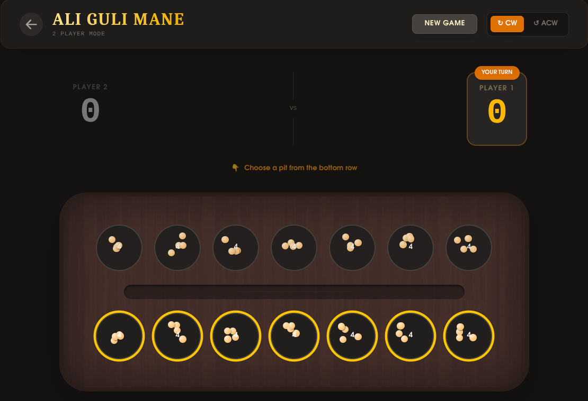

# Ali Guli Mane - Ancient Strategy Game



A high-fidelity digital recreation of **Ali Guli Mane** (Chenne Mane), a traditional mancala-style board game from Karnataka, South India. Built with modern web technologies for a smooth, immersive experience.

## 🌟 Features

- **Authentic Gameplay**: 
    - Full implementation of traditional rules including **Sowing**, **Capture**, **Saada (Stop)**, and **Double Saada**.
    - Accurate game mechanics where capturing requires landing in an empty hole and taking seeds from the opposite side.
- **Game Modes**:
    - **🤖 VS Computer**: Challenge a smart AI opponent that follows strategic sowing patterns.
    - **👥 2 Player (PVP)**: Play locally with a friend on the same device.
- **Immersive Design**:
    - Beautiful wood-textured board with realistic pit designs.
    - **Animated Movement**: Seeds travel visually from hole to hole (no instant jumps).
    - **Glassmorphic UI**: Modern, translucent controls and scorecards.
    - **Responsive**: Fully optimized for Desktop, Tablet, and Mobile play.

## 🚀 Built With

- **React 19**: For a robust component-based architecture.
- **Vite**: Blazing fast build tool and dev server.
- **Tailwind CSS v4**: For advanced styling and responsive design.
- **Framer Motion**: For smooth, physics-based animations (seed movement, UI transitions).

## 🎮 How to Play

1. **Objective**: Capture more seeds than your opponent.
2. **Sowing**:
   - Picking a hole distributes its seeds one-by-one into subsequent holes.
   - You can choose to sow **Clockwise** or **Anti-Clockwise**.
3. **Capture**:
   - If your last seed lands in an empty hole, you capture the seeds from the *next* hole and its opposite hole.
   - If the next hole is also empty, the turn ends (Saada).
4. **Game Over**:
   - The game ends when a player has no seeds left to move.
   - Remaining seeds on the board are awarded to their respective owners.

## 🛠️ Setup & Development

1. **Clone the repository**:
   ```bash
   git clone https://github.com/yourusername/ali-guli-mane.git
   ```
2. **Install dependencies**:
   ```bash
   npm install
   ```
3. **Run development server**:
   ```bash
   npm run dev
   ```
4. **Build for production**:
   ```bash
   npm run build
   ```

## 📦 Deployment

This project is optimized for deployment on **Vercel**.
- `vercel.json` included for SPA routing configuration.

---
*Built with ❤️ by Sohan*
